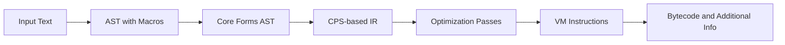

# Scratch documents

This file contains lose notes used during development. They will eventually be assembled into proper documentation.

## Basic approach to build the language

Read and parse the input text to produce an AST.
Perform macro expansion to obtain an AST with only Scheme core forms.
Apply CPS transformation to the core forms AST, resulting in a CPS-based IR.
Perform optimization passes on the CPS-based IR (details to be determined).
Generate VM instructions, compiling each closure into a chunk.
Emit the bytecode and any additional information required by the VM to execute the code.

